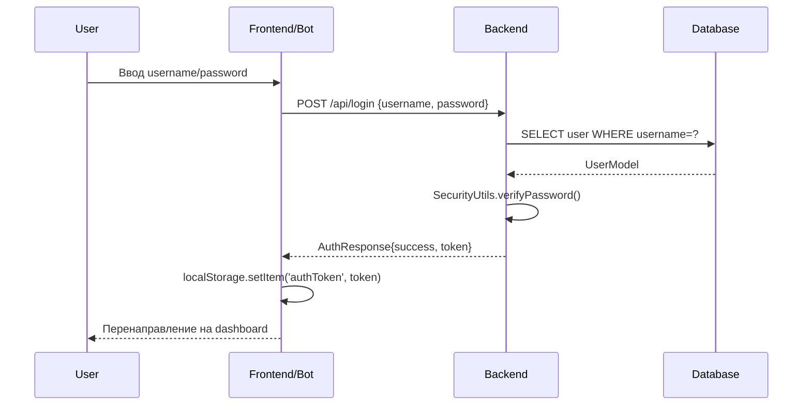
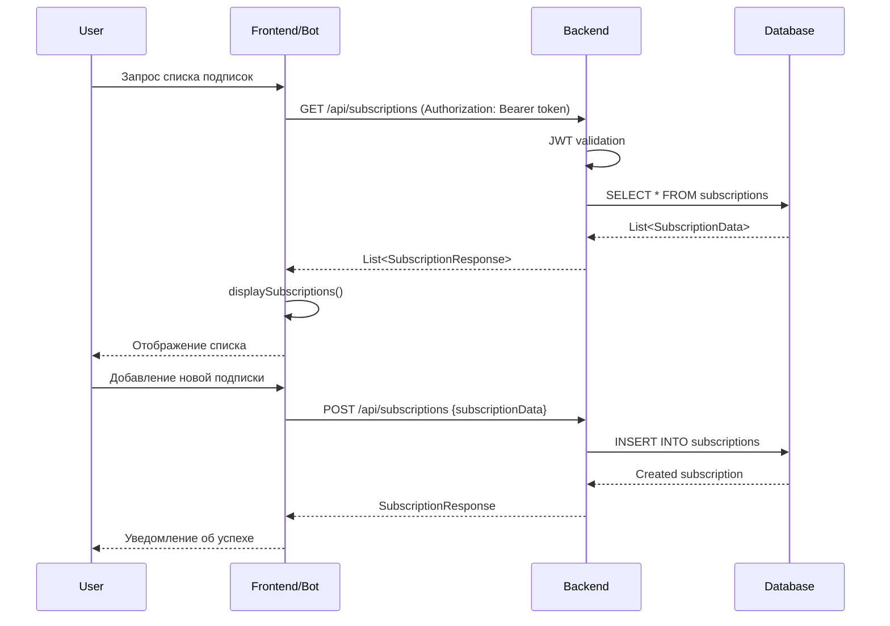

# Архитектура SubTracker

## 🏗️ Общая архитектура системы

SubTracker состоит из нескольких независимых модулей:

```
SubTracker/
├── 🖥️ backend/             # REST API (Kotlin + Spring Boot 3 + SQLite/PostgreSQL)
├── 🌐 web-frontend/        # Веб-интерфейс (Next.js + TypeScript)
└── 🤖 telegram-bot/        # Telegram бот (Python + aiogram)
```

### 🔧 Модули

#### 🖥️ **:backend** - API сервер
- **Spring Boot 3** как основной фреймворк
- **Kotlin** как основной язык программирования
- **Spring Data JPA** для работы с БД
- **Spring Security** для аутентификации и авторизации
- **JWT** для токенов аутентификации
- **HikariCP** пул соединений
- **SQLite** база данных для разработки
- **PostgreSQL** для продакшена
- RESTful API endpoints
- Система регистрации и авторизации

#### 🌐 **:web-frontend** - Веб-интерфейс
- **Next.js** фреймворк для React приложений
- **TypeScript** для типобезопасной разработки
- **Tailwind CSS** для стилизации
- Современный responsive дизайн
- Система аутентификации (вход/регистрация)
- Интеграция с backend API через fetch
- Тестовый пользователь: user/user
- Статистика и аналитика

#### 🤖 **:telegram-bot** - Telegram бот
- **Python** как основной язык программирования
- **aiogram** фреймворк для работы с Telegram Bot API
- Интуитивное меню с кнопками
- Пошаговое добавление подписок
- Статистика и управление
- Интеграция с backend API через HTTP запросы
- Обработка ошибок

## 🔄 Поток данных и взаимодействия

### 1. Аутентификация пользователя



### 2. Управление подписками



## 🗄️ Схема базы данных

### Таблица Users
```sql
CREATE TABLE Users (
    id TEXT PRIMARY KEY,
    username TEXT UNIQUE NOT NULL,
    email TEXT UNIQUE NOT NULL,
    password_hash TEXT NOT NULL,
    telegram_id BIGINT UNIQUE,
    created_at DATE NOT NULL,
    updated_at DATE NOT NULL
);
```

### Таблица Subscriptions
```sql
CREATE TABLE Subscriptions (
    id TEXT PRIMARY KEY,
    user_id TEXT NOT NULL,
    name TEXT NOT NULL,
    price DECIMAL(10,2) NOT NULL,
    currency TEXT NOT NULL,
    billing_cycle TEXT NOT NULL,
    next_payment_date DATE NOT NULL,
    is_active BOOLEAN DEFAULT TRUE,
    created_at DATE NOT NULL,
    updated_at DATE NOT NULL,
    FOREIGN KEY (user_id) REFERENCES Users(id)
);
```

## 🔒 Система безопасности

### JWT Authentication Flow

1. **Регистрация/Вход:**
   - Пароли хешируются через SHA-256
   - При успешной аутентификации генерируется JWT токен
   - Токен содержит claims: username, userId, audience, issuer

2. **Авторизация запросов:**
   - Все защищенные endpoints требуют `Authorization: Bearer <token>`
   - JWT токен валидируется на каждый запрос
   - При невалидном токене возвращается 401 Unauthorized

3. **Конфигурация JWT:**
```kotlin
val jwtSecret = "your_secret_key" // Из переменных окружения
val jwtIssuer = "SubTracker"
val jwtAudience = "users"
val jwtRealm = "ktor.io"
```

### CORS Configuration
```kotlin
@Configuration
class CorsConfig {
    @Bean
    fun corsConfigurationSource(): CorsConfigurationSource {
        val configuration = CorsConfiguration()
        configuration.allowedOrigins = listOf("http://localhost:3000")
        configuration.allowedMethods = listOf("GET", "POST", "PUT", "DELETE", "OPTIONS")
        configuration.allowedHeaders = listOf("*")
        configuration.allowCredentials = true
        
        val source = UrlBasedCorsConfigurationSource()
        source.registerCorsConfiguration("/**", configuration)
        return source
    }
}